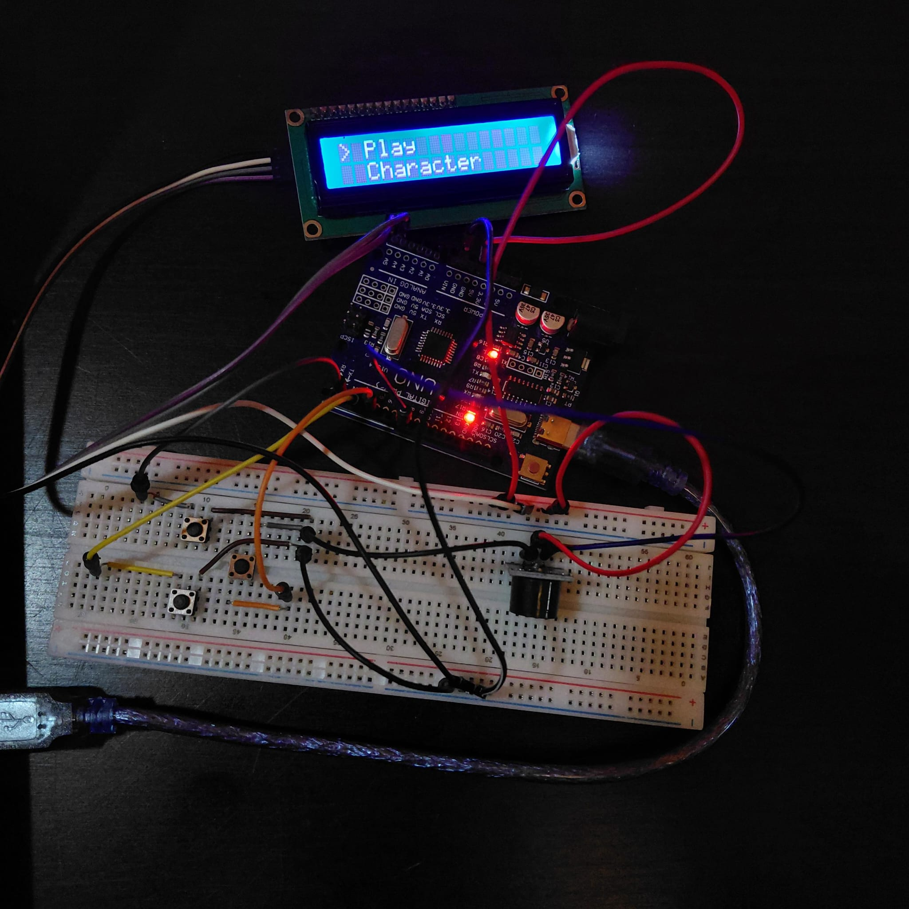

# Arduino Chrome Dino Game


An embedded systems implementation of Google's Chrome Dino game, developed on an Arduino Uno using a 16×2 I2C LCD. The project demonstrates finite state machine design, hardware-software integration, EEPROM data storage and real-time event-driven programming. This project was developed independently to strengthen my embedded systems and C++ programming skills by combining hardware interfacing with structured software design.

> **Developed as a personal embedded systems project to strengthen C++ programming, embedded software design, and hardware interfacing skills.**

## 🎥 Project Preview

<p align="center">
  
</p>

🔊 **Full Demonstration (with audio):**
https://youtu.be/i6w-xwKN6Ec

## Project Highlights

- Designed a complete embedded game using an Arduino Uno.
- Developed a menu-driven user interface controlled using three push buttons.
- Implemented a finite state machine to manage menus, gameplay and game states.
- Created four selectable characters and four themed maps using custom LCD sprites.
- Stored settings and high scores in EEPROM for persistent memory.
- Added configurable difficulty levels, sound effects and animated gameplay.
- Debugged hardware and software interactions including input handling, LCD refresh optimisation and EEPROM management.

---

## Features

- Chrome Dino gameplay
- Four selectable characters
- Four themed maps
- Three difficulty levels
- EEPROM high-score storage
- EEPROM settings storage
- Animated LCD sprites
- Random obstacle generation
- Progressive difficulty scaling
- Pause system
- Countdown before gameplay
- Sound effects
- Three-button menu navigation

## Gameplay

- Chrome Dino-inspired gameplay
- Jump mechanics
- Ground and aerial obstacles
- Progressive increase in game speed
- Collision detection
- Countdown before gameplay
- Pause functionality
- High score tracking

## Technical Implementation

The game is organised using a finite state machine (FSM), allowing the software to transition between menus, gameplay and game over based on user input and game events. This modular structure simplifies navigation and makes the project easier to maintain and extend.

Custom LCD characters are used for animated characters and obstacles, while EEPROM provides persistent storage for the player's settings and high score.

## User Interface

- Main menu
- Character selection
- Map selection
- Difficulty selection
- High score screen
- Sound feedback
- Animated sprites

## Persistent Storage

- High score saved using EEPROM
- Character selection saved
- Map selection saved
- Difficulty saved

## Hardware Used

- Arduino Uno
- 16×2 I2C LCD Display
- Three Push Buttons
- Passive Buzzer
- Breadboard
- Jumper Wires

<p align="center">
  
</p>

---

## System Architecture

```text
          ┌─────────────┐
          │ Push Buttons│
          └──────┬──────┘
                 │
                 ▼
         ┌────────────────┐
         │  Arduino Uno   │
         │ (ATmega328P)   │
         └───┬────────┬───┘
             │        │
        I²C  │        │ Digital
             ▼        ▼
      ┌──────────┐ ┌────────┐
      │ 16×2 LCD │ │ Buzzer │
      └──────────┘ └────────┘
             │
             ▼
          EEPROM
```
---

## Software

- C++
- Arduino IDE
- LiquidCrystal_I2C
- EEPROM 

---

## Controls

| Button | Function |
|---------|----------|
| Up | Jump / Navigate Up |
| Down | Navigate Down |
| Select | Confirm Selection / Pause |

---

## Engineering Skills Demonstrated

- Embedded C++ programming
- Embedded systems development
- Hardware/software integration
- Finite state machine implementation
- EEPROM memory management
- LCD graphics and sprite animation
- Event-driven programming
- Digital input processing
- Real-time game logic
- Debugging and iterative development


## Challenges Solved

During development I encountered and solved several engineering challenges, including:

- Replacing an analogue joystick with a more reliable three-button control system.
- Reducing LCD flickering by optimising display updates.
- Implementing persistent EEPROM storage while handling uninitialised memory.
- Designing reusable sprite loading for multiple characters and maps.
- Balancing gameplay by tuning obstacle timing and speed progression.
- Debugging button input timing and jump mechanics.


## Future Improvements

- Duck mechanic
- Multiple simultaneous obstacles
- Additional maps and characters
- OLED display version
- ESP32 version with online leaderboard
- Battery-powered handheld version


## What was learned

This project strengthened my understanding of embedded systems by combining hardware design with software development. It improved my ability to design structured embedded software, debug hardware/software interactions, implement persistent memory using EEPROM and optimise user interaction on resource-constrained hardware.


